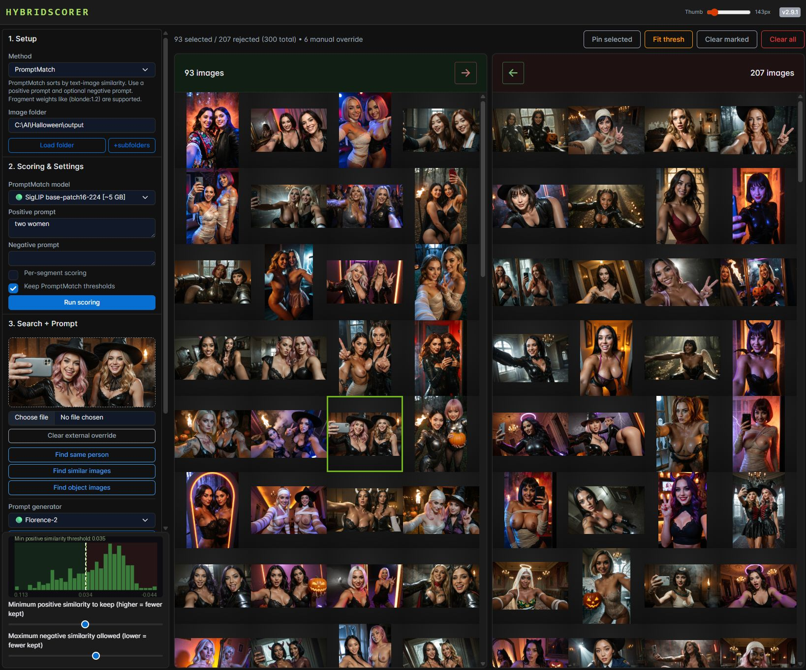

# HybridScorer

Stop manually digging through huge image folders. `HybridScorer` helps you score, sort, and cut large sets down fast with GPU-accelerated AI plus human review. Windows/Linux.

Current version: `1.42.0` (`v1.42.0` on GitHub releases)

## Screenshot

`Hybrid-Scorer.py` lets you switch between PromptMatch for content matching and ImageReward for aesthetic scoring inside one shared workflow.



## Too Many Images?

If you generate a lot of images, collect references, or review large image folders, the slow part is rarely making the images. The slow part is deciding what to keep.

- Hundreds or thousands of files are too much to rank by hand.
- Near-duplicates and weak variations waste time.
- It is hard to filter for a specific subject, look, pose, mood, or quality level consistently.
- Manual curation gets even worse when you want to keep the best images without touching the originals.

`HybridScorer` is built to solve exactly that workflow: score a folder, split it into likely keepers and rejects, quickly fix the edge cases yourself, and export a clean result.

## What This Is

`HybridScorer` is a practical human-in-the-loop image triage tool for people who need to review a lot of images quickly without giving up control.

- Use **PromptMatch** to find images that match a concept, subject, outfit, pose, expression, or visual trait.
- Use **ImageReward** to sort for taste, aesthetic quality, style, and overall appeal.
- Review the split in one interface, then manually correct the few exceptions instead of sorting everything by hand.
- Generate a reusable prompt from any image you like while you review.
- Keep the original files untouched. Export is a lossless copy into `selected/` and `rejected/`.
- CUDA keeps scoring fast enough to stay useful on large folders, and proxy caching speeds up repeat work and browsing.

### Why People Use It

- AI image generations: cut thousands of outputs down to the few worth keeping.
- Reference boards and collected folders: find the images that actually match the idea in your head.
- Aesthetic filtering: separate strong images from weak ones faster than manual pass-after-pass review.
- Prompt iteration: find one image that works, generate a prompt from it, and rescore again.

### Prompt From Image

If you find an image you like while reviewing, `HybridScorer` can turn that preview image into an editable prompt you can reuse right away.

- Generate a prompt from the currently previewed image.
- Choose between lighter `Florence-2` captions or stronger `JoyCaption` variants.
- Edit the generated text, then insert it back into the active scoring prompt.

## Main App

| App | Best for | How it scores | Output buckets |
| --- | --- | --- | --- |
| `Hybrid-Scorer.py` | Switching between content matching and aesthetic ranking in one place | PromptMatch with CLIP-family models or ImageReward with optional penalty prompt | `selected` / `rejected` |


## Install With Setup Scripts

Set up the Python virtual environment first. You need to do this before trying to run the app.

### Windows Setup Script

Use [setup-venv312-windows.bat](setup-venv312-windows.bat) 

to create Python virtual environment needed. It will install Python 3.12 with `winget` if missing:

```bat
setup-venv312-windows.bat
```
### Linux Setup Script

Use [setup-venv312.sh](setup-venv312.sh)

 To create Python virtual environment needed.

```bash
./setup-venv312.sh
```

If you also want the optional JoyCaption GGUF backend, rerun setup with:

```bash
INSTALL_JOYCAPTION_GGUF=1 ./setup-venv312.sh
```

## Run

After the virtual environment is set up, just run the launcher script. The run scripts activate `venv312` automatically.

### Windows

```bat
run-Hybrid-Scorer-windows.bat
```
### Linux

```bash
./run-Hybrid-Scorer.sh
```

Opens automaticaly in your browser:

- `http://localhost:7862` for HybridScorer


 

## Model Downloads

Model weights are downloaded on first use only for the method and model you actually choose.

- The default PromptMatch model is `SigLIP so400m-patch14-384`, which is about **3.3 GB** downloaded and is a good balance of quality and size.
- PromptMatch also supports OpenCLIP ConvNeXt backbones if you want additional alternatives in the same prompt-based workflow.
- The heaviest PromptMatch option is `OpenCLIP ViT-bigG-14 laion2b`, which is about **9.5 GB** downloaded.
- `ImageReward` is also downloaded on first use when you switch to that method.
- Florence prompt generation downloads `florence-community/Florence-2-base` on first use when you choose that prompt generator.
- JoyCaption HF prompt generation downloads `fancyfeast/llama-joycaption-beta-one-hf-llava` on first use when you choose that prompt generator. It is much heavier than Florence and is best suited to 24 GB class GPUs.
- JoyCaption GGUF uses a separate optional llama.cpp runtime plus the `Q4_K_M` GGUF and matching mmproj files when you choose that backend.
- The UI now shows whether a model is being loaded from memory, disk cache, or a likely network download so users are not left guessing.

So users do **not** need to download every model up front, but the first run of a new model can take a while depending on connection speed.


## Usage

The app is built for a fast review loop: score a folder, inspect the split, make manual corrections, then export a clean final selection.

### Basic Workflow

- Start the app and open your image folder.
- Choose a method.
- Use **PromptMatch** for subject, concept, or attribute matching.
- Use **ImageReward** for aesthetic, style, and overall preference sorting.
- Enter your prompt settings.
- Click **Run scoring**.
- Review the `SELECTED` and `REJECTED` galleries.
- Preview an image and use **3. Prompt from preview image** if you want the app to draft a prompt you can edit and reuse.
- Adjust the threshold sliders or click directly on the histogram to refine the split.
- Leave **Use proxies for gallery display** enabled for large folders if you want much faster gallery refreshes.
- Manually move exceptions between buckets if needed.
- Click **Export folders** to losslessly copy the final result into `selected/` and `rejected/`.

### Prompt From Preview Image

Use the prompt-generation utility when you want the app to draft a generation or edit prompt from one image you already like.

- Click any thumbnail so it becomes the current preview image.
- Open **3. Prompt from preview image** in the sidebar.
- Choose a **Prompt generator**. `Florence-2` is lighter. `JoyCaption Beta One` is heavier but usually better on NSFW or more explicit content. `JoyCaption Beta One GGUF (Q4_K_M)` is the optional lower-VRAM backend.
- Click **Generate prompt from preview**.
- The app writes the result only into the editable **Generated prompt** box.
- Use **Prompt detail** to switch between core facts, balanced detail, and full detail for the selected generator.
- For JoyCaption, those three modes are intentionally different in style:
  `Core facts` is short comma-style tags, `Balanced` is a compact prompt line, and `Full` is natural descriptive prose.
- Edit that generated prompt if you want to refine wording before scoring again.
- Click **Insert into active prompt** if you want to copy your edited scratch prompt into the active method field.
- This utility only targets the active main positive prompt in v1. It does not write into PromptMatch negative prompt or ImageReward penalty prompt.

### PromptMatch

Use PromptMatch when you want to find images that match a text description.

- Set a **positive prompt** for what you want.
- Optionally set a **negative prompt** for what should count against a match.
- PromptMatch supports fragment weights like `beautiful (blonde:1.2) woman` when you want one part of the prompt to matter more. Values above `1.0` emphasize a fragment and values below `1.0` soften it. The same syntax also works in the negative prompt. This weighting syntax is PromptMatch-only; ImageReward still treats it as plain text.
- In the PromptMatch positive and negative prompt boxes, select text and press `Ctrl` + `+` or `Ctrl` + `-` to wrap it in weighting syntax or nudge an existing weight by `0.1` at a time.
- In both PromptMatch and ImageReward prompt boxes, press `Ctrl` + `Return` to run scoring.
- Choose the PromptMatch model from the dropdown. Available families include SigLIP, OpenCLIP ViT, OpenCLIP ConvNeXt, and OpenAI CLIP.
- PromptMatch shows proxy preparation, model loading source, and scoring autobatch size in the progress UI.
- Use the **main threshold** to control how strong the positive match must be.
- If you use a negative prompt, use the **negative threshold** to control how strongly that negative signal is allowed to pass.

### ImageReward

Use ImageReward when you care more about style, mood, or overall visual appeal than literal content matching.

- Set an **ImageReward positive prompt** describing the look you want.
- Optionally set an **experimental penalty prompt** to subtract an unwanted style or mood.
- Increase **penalty weight** with the `0.0` to `4.0` slider if the penalty prompt should matter more.
- Penalty weight now recalculates the final score instantly from the stored positive and penalty passes; it does not rescore the folder.
- The penalty is applied relative to the current folder's penalty scores, so raising the penalty weight makes stronger negative-prompt matches stricter without accidentally boosting selection.
- ImageReward also uses the proxy cache and shows autobatch size in the progress UI.
- Use the **main threshold** to decide which images land in `SELECTED`.

### Proxy Cache

Large folders are faster because the app can build reusable proxy images with the longest edge capped at `1024px`.

- Proxy creation is multithreaded.
- Proxies are cached in the system temp directory under `HybridScorerPromptMatchProxyCache`.
- The cache is reused while you keep working on the same folder.
- When you switch folders in the UI, the previous folder's proxy cache is deleted.
- Export still copies the original source files, never the proxies.

### Reviewing And Manual Overrides

- `Shift+click` thumbnails to mark multiple images.
- Use **Move →** or **← Move** to manually override the current scoring result for marked images.
- Use **Clear status** to remove those manual overrides and let the images snap back to the score-based result.
- The green and red borders help show marked and manually overridden items during review.

### Histogram And Thresholds

- The histogram shows the current score distribution.
- In PromptMatch, the top chart is the positive threshold and the bottom chart is the negative threshold.
- In ImageReward, the histogram controls the single main threshold.
- You can also use **Or keep top N%** to automatically keep roughly the top part of the set.

### Export

Export does a **lossless file copy** of the originals.

- No recompression
- No resizing
- No metadata rewriting by the app
- Final folders are `selected/` and `rejected/`

## Manual Install

If you do not want to use the setup scripts, you can set up the environment manually.

`requirements.txt` includes the app-side compatibility dependencies, including pinned `transformers`, a modern `timm` for ConvNeXt-backed OpenCLIP models, plus the runtime extras needed by SigLIP and ImageReward. The setup scripts install `image-reward==1.5` separately with `--no-deps` so pip does not backtrack into the broken `image-reward==1.0` source build on fresh Python 3.12 environments.

If you want the optional JoyCaption GGUF backend in a manual setup, also install:

```bash
python -m pip install -r requirements-gguf.txt
```

### Linux Manual Install

```bash
python3.12 -m venv venv312
source venv312/bin/activate
python -m pip install --upgrade pip setuptools wheel
python -m pip install torch==2.9.1 torchvision==0.24.1 --index-url https://download.pytorch.org/whl/cu128
python -m pip install -r requirements.txt
python -m pip install --no-deps image-reward==1.5
```

If you choose a different `PYTORCH_CUDA_INDEX_URL`, make sure `torch==2.9.1` and `torchvision==0.24.1` are available on that index or adjust the pinned versions to match.

### Windows Manual Install

1. Install Python 3.12.
2. Make sure the Python launcher `py` is available.
3. Open `cmd.exe` in the project folder.
4. Create the virtual environment:
   ```bat
   py -3.12 -m venv venv312
   ```
5. Activate it:
   ```bat
   venv312\Scripts\activate.bat
   ```
6. Upgrade packaging tools:
   ```bat
   python -m pip install --upgrade pip setuptools wheel
   ```
7. Install CUDA-enabled PyTorch:
   ```bat
   python -m pip install torch==2.9.1 torchvision==0.24.1 --index-url https://download.pytorch.org/whl/cu128
   ```
8. Install the app dependencies:
   ```bat
   python -m pip install -r requirements.txt
   ```
9. Install the ImageReward runtime package without its older training-stack dependency pins:
   ```bat
   python -m pip install --no-deps image-reward==1.5
   ```

If you installed dependencies before ConvNeXt support was added, run this once to refresh `timm`:

```bat
python -m pip install --upgrade timm
```

If you choose a different `PYTORCH_CUDA_INDEX_URL`, make sure `torch==2.9.1` and `torchvision==0.24.1` are available on that index or adjust the pinned versions to match.

## Windows Requirements

For the Windows scripts to work end-to-end, the user needs:

- an NVIDIA GPU with a working CUDA-compatible driver
- internet access for pip installs, `winget` installs, and first-time model downloads
- either Python 3.12 and Git already installed, or `winget` available so the setup script can try to install them automatically

After that, the intended Windows flow is:

```bat
setup-venv312-windows.bat
run-Hybrid-Scorer-windows.bat
```

## CUDA Requirement

CUDA is mandatory for this project. The app is meant to rate and sort many images quickly, and that speed depends on GPU inference.

- If PyTorch cannot see a CUDA device, the app exits immediately.
- The setup scripts install pinned CUDA 12.8 PyTorch wheels by default.
- If your machine needs a different supported PyTorch CUDA wheel, set `PYTORCH_CUDA_INDEX_URL` before setup and update the pinned PyTorch versions if needed.

## Architecture

The repository centers on one Python app:

- **`Hybrid-Scorer.py`**: a combined interface that lets you switch between semantic prompt matching and aesthetic scoring in one place.

The app is built with [Gradio](https://www.gradio.app/) and uses PyTorch for model inference. Set up a local Python 3.12 virtual environment named `venv312` before running it.

### `Hybrid-Scorer.py` - Combined Selector

This app combines PromptMatch and ImageReward into one UI and lets you switch scoring methods without leaving the page.

**Key Features:**

- **Method Selector**: Switch between PromptMatch and ImageReward inside one app.
- **Shared Gallery Workflow**: One folder input, shared galleries, manual overrides, export, and threshold controls.
- **PromptMatch Mode**: Supports CLIP-family model selection plus positive and negative prompts.
- **ImageReward Mode**: Supports a positive aesthetic prompt, an experimental penalty prompt, and instant penalty-weight recalculation from stored scores.
- **Proxy Cache**: Reuses multithreaded `1024px` proxies for faster scoring and optional faster gallery display on large folders.
- **Load Visibility**: Shows whether models are already in memory or expected to come from disk cache / network download.
- **Histogram Threshold Selection**: Click the histogram to set thresholds directly.
- **Thumbnail Control**: Resize both galleries together with one top-bar slider.

## Files Included

Windows scripts:

- `setup-venv312-windows.bat`
- `run-Hybrid-Scorer-windows.bat`

Linux scripts:

- `setup-venv312.sh`
- `run-Hybrid-Scorer.sh`

Main cross-platform app:

- `Hybrid-Scorer.py`
- `VERSION`
- `CHANGELOG.md`

There are no separate Windows-only Python app files. Both operating systems use the same `Hybrid-Scorer.py`.

Dependency notes:

- `requirements.txt` contains the shared application dependencies.
- `requirements.txt` also includes the pinned `transformers` version, a current `timm` for ConvNeXt-backed OpenCLIP models, and the runtime extras used by SigLIP and ImageReward.
- The setup scripts install `image-reward==1.5` separately with `--no-deps` to avoid pip resolving down to the broken `image-reward==1.0` source package on clean Python 3.12 installs.
- Because `requirements.txt` includes OpenAI CLIP from GitHub, `git` must be installed and available in `PATH` during setup.
- Model weights are not stored in this repository. ImageReward, OpenCLIP, SigLIP, and OpenAI CLIP weights are downloaded on first use by their libraries. See **Model Downloads** above for the main first-run size expectations.

Place your images in a folder named `images` in the root of the repository to have them loaded at startup. You can also load images from any other folder using the UI.
