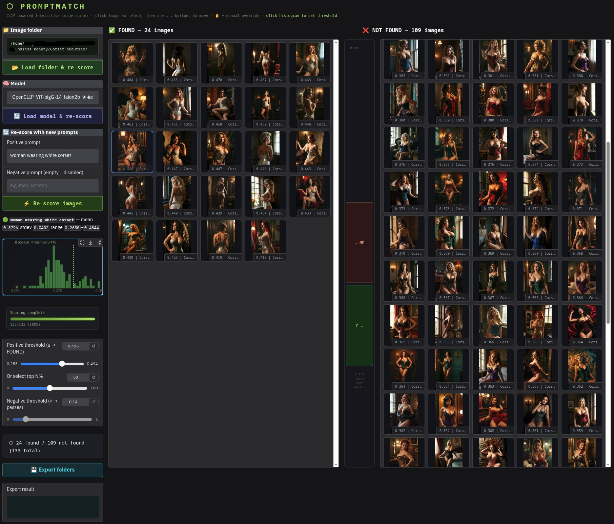
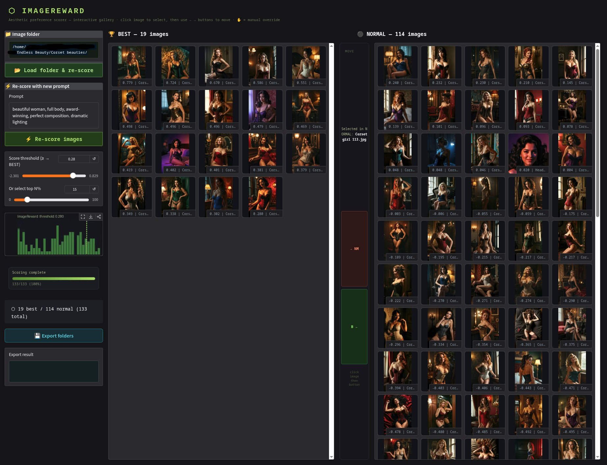

# RATEImagesCLIP

This repository contains two interactive Gradio applications for rating and sorting images with GPU-accelerated AI models.

## What This Is

`RATEImagesCLIP` is built for quick human-in-the-loop image triage.

- `promptmatch.py` finds images that match a subject, concept, or prompt.
- `imagereward.py` ranks images by aesthetic fit to a style prompt.
- CUDA is required so scoring stays fast enough to be practical on large folders.
- In the end, the apps losslessly copy the original image files into two output folders based on your final split.
- The source images are not recompressed or edited.

## Choose The App

| App | Best for | How it scores | Output buckets |
| --- | --- | --- | --- |
| `promptmatch.py` | Finding specific subjects, concepts, or visual attributes | Text-image similarity with CLIP, OpenCLIP, or SigLIP | `found` / `notfound` |
| `imagereward.py` | Ranking by taste, mood, style, and overall visual appeal | Aesthetic preference scoring with ImageReward | `best` / `normal` |

## Install With Setup Scripts

Set up the Python virtual environment first. You need to do this before trying to run either app.

### Linux Setup Script

Use [setup-venv312.sh](/home/vangel/apps/RATEImagesCLIP/setup-venv312.sh) to create `venv312`, install CUDA-enabled PyTorch, install `requirements.txt`, and verify that CUDA is available:

```bash
./setup-venv312.sh
```

### Windows Setup Script

Use [setup-venv312-windows.bat](/home/vangel/apps/RATEImagesCLIP/setup-venv312-windows.bat) to create `venv312`, install CUDA-enabled PyTorch, install `requirements.txt`, and verify that CUDA is available:

```bat
setup-venv312-windows.bat
```

## Run

After the virtual environment is set up, just run the script you want. The run scripts activate `venv312` automatically.

### Linux

```bash
./run-promptmatch.sh
```

or

```bash
./run-imagereward.sh
```

Open:

- `http://localhost:7861` for PromptMatch
- `http://localhost:7860` for ImageReward

### Windows

```bat
run-promptmatch-windows.bat
```

or

```bat
run-imagereward-windows.bat
```

## Manual Install

If you do not want to use the setup scripts, you can set up the environment manually.

### Linux Manual Install

```bash
python3.12 -m venv venv312
source venv312/bin/activate
python -m pip install --upgrade pip setuptools wheel
python -m pip install torch torchvision torchaudio --index-url https://download.pytorch.org/whl/cu126
python -m pip install -r requirements.txt
```

### Windows Manual Install

1. Install Python 3.12.
2. Open `cmd.exe` in the project folder.
3. Create the virtual environment:
   ```bat
   py -3.12 -m venv venv312
   ```
4. Activate it:
   ```bat
   venv312\Scripts\activate.bat
   ```
5. Upgrade packaging tools:
   ```bat
   python -m pip install --upgrade pip setuptools wheel
   ```
6. Install CUDA-enabled PyTorch:
   ```bat
   python -m pip install torch torchvision torchaudio --index-url https://download.pytorch.org/whl/cu126
   ```
7. Install the app dependencies:
   ```bat
   python -m pip install -r requirements.txt
   ```

## CUDA Requirement

CUDA is mandatory for this project. These apps are meant to rate and sort many images quickly, and that speed depends on GPU inference.

- If PyTorch cannot see a CUDA device, the app exits immediately.
- The setup scripts install CUDA 12.6 PyTorch wheels by default.
- If your machine needs a different supported PyTorch CUDA wheel, set `PYTORCH_CUDA_INDEX_URL` before setup.

## Screenshots

### PromptMatch
Finds images that match a subject or concept you describe in text, with optional negative prompting to exclude unwanted content.



### ImageReward
Ranks images by overall aesthetic fit to a style prompt, so it is better for taste, mood, and visual quality than literal content matching.



## Architecture

The repository consists of two main Python scripts, each providing a web-based UI for image evaluation:

1.  **`imagereward.py`**: An interactive tool for **aesthetic scoring** of images.
2.  **`promptmatch.py`**: An interactive tool for **semantic content matching** using CLIP models.

Both applications are built with [Gradio](https://www.gradio.app/) and use PyTorch for model inference. They are designed to be run as standalone scripts. Set up a local Python 3.12 virtual environment named `venv312` before running them.

### `imagereward.py` - Aesthetic Scorer

This tool uses the [ImageReward](https://github.com/THUDM/ImageReward) model (`ImageReward-v1.0`) to score images based on their aesthetic quality, guided by a text prompt.

**Key Features:**

*   **Aesthetic Scoring**: Ranks images based on how well they match a desired aesthetic (e.g., "cinematic," "high fashion").
*   **Best/Normal Galleries**: The UI is split into "BEST" and "NORMAL" galleries.
*   **Score Threshold**: A slider allows you to dynamically set the score threshold to move images between the two galleries.
*   **Manual Override**: Manually move images between galleries if the model's score is not to your liking.
*   **Re-scoring**: Change the prompt to re-evaluate all images based on a new aesthetic.
*   **Export**: Save the sorted images into `best` and `normal` subdirectories.

### `promptmatch.py` - Semantic Sorter

This tool uses various CLIP-style models to find images that match a specific textual description (semantic content).

PromptMatch supports multiple model families so you can trade speed, memory use, and matching quality:

- **OpenAI CLIP**: the original CLIP models.
- **OpenCLIP**: strong open-source CLIP variants, including larger high-quality models.
- **SigLIP**: newer Google models that are often very strong for text-image matching.

**Key Features:**

*   **Flexible Model Backend**: Switch between OpenAI CLIP, OpenCLIP, and SigLIP in the UI.
*   **Positive & Negative Prompts**: Sort images based on a **positive prompt** (what you want to find) and an optional **negative prompt** (what you want to exclude).
*   **Found/Not Found Galleries**: The UI is split into "FOUND" and "NOT FOUND" galleries.
*   **Dual Thresholds**: Independent sliders for positive and negative similarity scores provide fine-grained control.
*   **On-the-Fly Model Switching**: Load and switch between different CLIP models directly from the UI.
*   **Export**: Save the sorted images into `found` and `notfound` subdirectories.

## Files Included

Windows-ready entrypoints:

*   `imagereward_windows.py`
*   `promptmatch_windows.py`
*   `setup-venv312-windows.bat`
*   `run-imagereward-windows.bat`
*   `run-promptmatch-windows.bat`

Dependency notes:

- `requirements.txt` contains the shared application dependencies.
- Because `requirements.txt` includes OpenAI CLIP from GitHub, `git` must be installed and available in `PATH` during setup.
- Model weights are not stored in this repository. ImageReward, OpenCLIP, SigLIP, and OpenAI CLIP weights are downloaded on first use by their libraries.

Place your images in a folder named `images` in the root of the repository to have them loaded at startup. You can also load images from any other folder using the UI.
