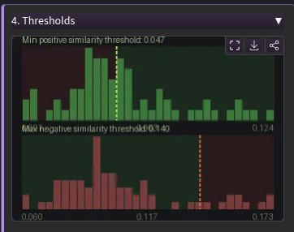

# HybridScorer

`HybridScorer` is a 100% local app for sorting large folders of images with AI scoring.

Current version: `2.1.0`

## What The App Does

HybridScorer cuts large image sets down to size fast. Point it at a folder, let the AI score everything, then review a clean `SELECTED` / `REJECTED` split and export what you want to keep. No cloud, no uploads — all processing runs on your local GPU.

Working modes in the current app:

- `PromptMatch` — describe what you want in plain text and score the whole folder against it
- `ImageReward` — rank images by how well they match a prompt, weighted against unwanted content
- `LM Search` — use a local vision-language model to deeply understand each image, not just match keywords
- `Similarity` — pick one image you like and find everything in the folder that looks like it
- `SamePerson` — pick a face and pull every image of that person from the folder automatically

Everything in the app is built around the same fast loop:

- generate a prompt from any preview image and feed it straight into scoring
- export your kept images by copy or by move
- the histogram shows you exactly where the threshold cuts, so you keep control
- re-scoring reuses cached results — switching prompts or tweaking the threshold is near-instant
- manually move any image between buckets — overrides AI re-scoring allways when needed

## Screenshots




The image sorting updates live as you move the thresholds. The red/green split shows exactly which images cross the cut — hover over any thumbnail and its score appears as a marker on the graph. You can drag the slider or click anywhere directly on the histogram to set the cut point instantly. Or hit **Fit thresh** to let the app position it automatically based on your current manual picks.

## Install

Clone the repo:

```bash
git clone https://github.com/vangel76/HybridScorer.git
cd HybridScorer
```

then run:

### Windows

```bat
setup_update-windows.bat
```

### Linux

```bash
./setup_update-linux.sh
```


What the setup scripts do now:

- create or refresh the folder `venv312` containing all packages needed:
- install CUDA-enabled PyTorch
- install the main app requirements
- install `onnxruntime-gpu` for face search
- install the JoyCaption GGUF runtime into `venv312`
- verify that CUDA is available before finishing

The setup scripts also try a safe `git pull --ff-only` first when the checkout is clean and has an upstream branch.

## Run

### Windows

```bat
run-Hybrid-Scorer-windows.bat
```

### Linux

```bash
./run-Hybrid-Scorer.sh
```

The Gradio UI appears at local URL:

- `http://localhost:7862`


## Current Runtime Model

CUDA is mandatory for the app.

The app is designed around local GPU inference:

- PromptMatch models run on CUDA
- ImageReward runs on CUDA
- SamePerson uses InsightFace with CUDA-enabled ONNX Runtime
- JoyCaption GGUF expects a CUDA-enabled `llama-cpp-python` build

If `torch.cuda.is_available()` is false, the setup scripts fail intentionally.

## Prompt Generation

Prompt generation works from the currently previewed image.

Current prompt generators:

- `Florence-2`
- `JoyCaption Beta One`
- `JoyCaption Beta One GGUF (Q4_K_M)`

Behavior:

- generated text is stored separately until you insert it
- you can insert it into `PromptMatch`, `ImageReward`, or `LM Search`
- prompt detail has 3 levels
- backend instances are cached in memory once loaded

## LM Search

`LM Search` is a scored mode in the current app, not just a helper action.

Current behavior:

1. PromptMatch creates a shortlist from your text query
2. a local vision-language backend reranks only the shortlisted images
3. non-shortlisted images get a deterministic reject-floor score

Current backend options:

- `Florence-2`
- `JoyCaption Beta One`
- `JoyCaption Beta One GGUF (Q4_K_M)`

Current default LLM Search backend:

- `JoyCaption Beta One GGUF (Q4_K_M)`

## Cache Behavior

Cache defaults are OS-sensitive:

- Windows default: project-local caches under `models/` and `cache/`
- Linux default: system caches under `~/.cache/...` and proxy cache under the temp directory

Override with:

- `HYBRIDSCORER_CACHE_MODE=project`
- `HYBRIDSCORER_CACHE_MODE=system`

Project-mode cache directories used by the app:

- `models/huggingface`
- `models/clip`
- `models/ImageReward`
- `models/insightface`
- `cache/`

## Main Models And Downloads

Models are downloaded on first use for the mode/backend you actually select.

Highlights:

- default PromptMatch model: `SigLIP so400m-patch14-384`
- ImageReward model: `ImageReward-v1.0`
- face search model pack: `InsightFace buffalo_l`
- Florence prompt generation: `florence-community/Florence-2-base`
- JoyCaption HF: `fancyfeast/llama-joycaption-beta-one-hf-llava`
- JoyCaption GGUF: `cinnabrad/llama-joycaption-beta-one-hf-llava-mmproj-gguf`

## PromptMatch Models

The current PromptMatch dropdown is intentionally trimmed to a practical set instead of every possible variant.

Use cases:

- smaller VRAM / lighter default: `SigLIP`
- stronger NSFW-oriented matching: the OpenCLIP LAION variants
- heavier high-end option: `OpenCLIP ViT-bigG-14 laion2b`

`ImageReward` is separate from PromptMatch and does not use that model dropdown.

## What The App Is Not

- not a cloud service
- not a hosted tagging system
- not a DAM or catalog product
- not a database-style auto-indexer

It is a local human-in-the-loop sorting tool for image folders.

## Manual Setup

If you do not use the setup scripts, the expected environment is still:

```bash
python3.12 -m venv venv312
source venv312/bin/activate
pip install --upgrade pip setuptools wheel
pip install -r requirements.txt
pip install onnxruntime-gpu
pip install --no-deps image-reward==1.5
CMAKE_ARGS="-DGGML_CUDA=on" FORCE_CMAKE=1 pip install --upgrade --force-reinstall --no-cache-dir -r requirements-gguf.txt
```

You also need a CUDA-enabled PyTorch install that matches your system and GPU.

## Repo Notes

- main app entry: `Hybrid-Scorer.py`
- launcher scripts use `venv312`
- the app is intentionally a large single-file Gradio app
- architecture and behavior details live in:
  - [docs/architecture.md](docs/architecture.md)
  - [docs/behavior-notes.md](docs/behavior-notes.md)
